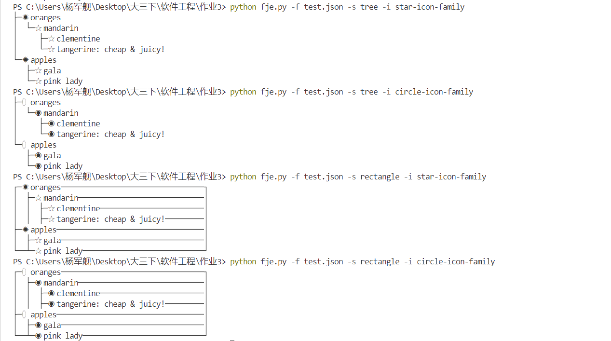

# Design Pattern进阶

21307337_杨军舰

## 设计文档：

见design.md：已上传github。

### 代码结构：

1. **interfaces.py** ：包含所有接口定义，包括迭代器、访问者、可视化元素和可视化工厂的接口。
2. **visualization.py** ：包含数据可视化相关的类。
3. **factories.py** ：包含工厂类，包含创建具体可视化对象的工厂类
4. **visitors.py** ：包含访问者类，用于处理具体的可视化逻辑。
5. **explorer.py** ：包含 FunnyJsonExplorer 类。负责加载数据和展示可视化结果。
6. **main.py** ：包含程序入口和命令行解析。

### 访问者模式

 **目的** ：分离算法与对象结构，通过访问者类来定义新的操作，避免在元素类中增加额外的操作。

 **实现** ：定义 `Visitor` 接口，并在 `TreeVisualization` 和 `RectangleVisualization` 类中实现 `accept` 方法。具体的访问者类 `JsonBuilderVisitor` 实现了对这两种可视化类型的处理逻辑。

### 迭代器模式

 **目的** ：提供一种方法顺序访问一个聚合对象中的各个元素，而不暴露其内部表示。

 **实现** ：`DataVisualization` 类实现了 `__iter__` 方法，返回输出列表的迭代器，使得可以使用迭代器模式遍历可视化输出。

## 运行截图：



## 源代码库：

```
https://github.com/junjian111/Design-Pattern-.git
```
